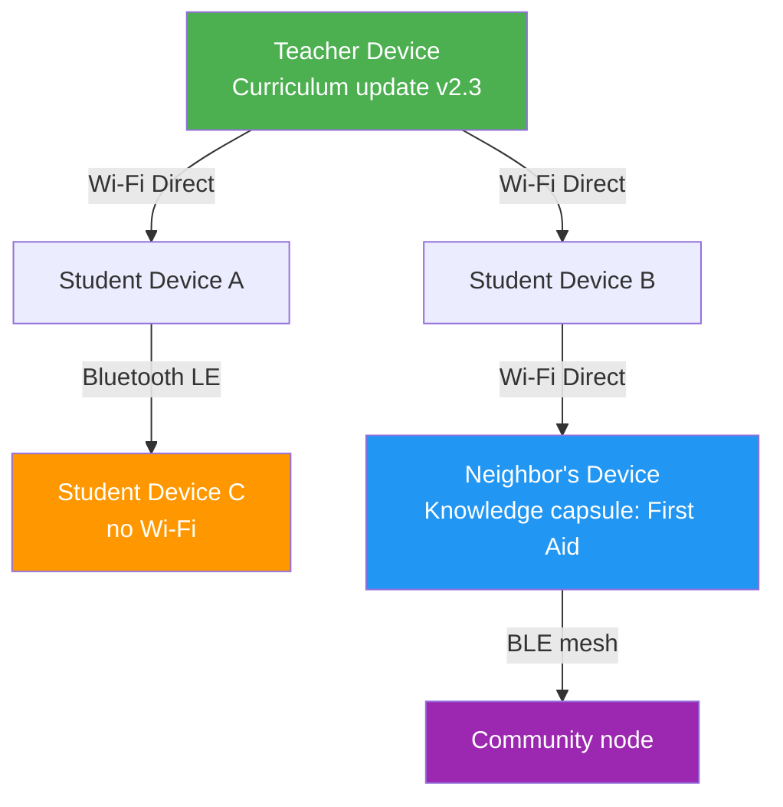
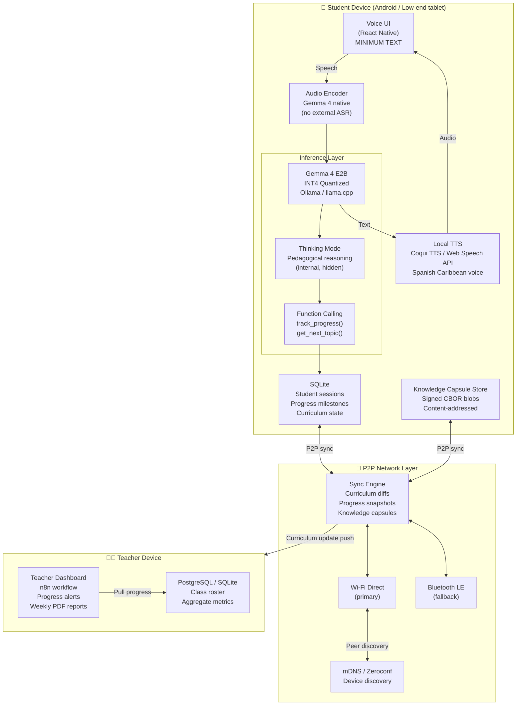
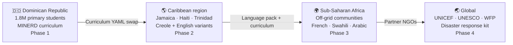

# EducaT — Adaptive Offline AI Tutor with P2P Knowledge Mesh

> [!abstract] One-Liner
> EducaT is a **100% offline-first adaptive tutoring system** powered by quantized Gemma 4, where knowledge propagates peer-to-peer across devices via Wi-Fi Direct / Bluetooth — democratizing personalized education in disconnected, crisis-prone communities.

**Hackathon:** [Gemma 4 Good — Kaggle × Google DeepMind](https://www.kaggle.com/competitions/gemma-4-good-hackathon)
**Tracks:** `Future of Education` · `Global Resilience`
**Deadline:** May 18, 2026 (23:59 UTC) · **Prize Pool:** $200,000 USD
**Model:** Gemma 4 E2B (INT4 quantized) + Gemma 4 E4B (fallback)
**License:** Apache 2.0

---

## 0. Brand Identity

### 0.1 Name & Public Alias

**EducaT** fuses *Educa* (from Spanish *educar*, to educate) with the letter **T**, which carries three simultaneous meanings: **Teacher**, **Technology**, and **Taíno** — the indigenous people of Hispaniola. This layering honors Dominican heritage while signaling a technology-driven mission.

Public-facing deployment name: **TutorRD** — national identity and product function legible to any parent, teacher, or policymaker at first glance.

### 0.2 Mission

EducaT exists to give every student the second explanation — the patient, adaptive re-teaching that overcrowded classrooms structurally cannot provide. It deploys adaptive AI tutoring directly onto devices already in students' hands, eliminating dependency on infrastructure that has never arrived.

### 0.3 Core Values

| Value | Definition |
|---|---|
| **Equity** | Personalized guidance regardless of geography or zip code |
| **Humility** | AI assists teachers — it does not replace them |
| **Rigor** | All content adheres to the Dominican national curriculum (MINERD 2024) |
| **Resilience** | Engineered to function where conditions are hardest |

### 0.4 Primary Audience

Primary users: students in Dominican public schools, emphasis on underserved rural and semi-urban regions. Secondary users: classroom teachers who leverage analytics and content-generation tools to extend their capacity in overcrowded settings.

> [!note] Grade Range — Open Decision
> The original `main.md` scopes grades **1–6**. `EducaT_Project_Draft.md` proposes grades **3–9**.
> Resolve before submission: broader range (3–9) adds impact narrative but increases curriculum content scope.

---

## 1. Problem Statement

> [!warning] The Core Gap
> **Frontier AI tutoring exists — but only where infrastructure does.**

Across Latin America, Sub-Saharan Africa, and rural Asia, over **1.1 billion school-age children** face a compounding crisis:

| Dimension | Reality |
|---|---|
| **Connectivity** | 40–60 % of rural schools have no stable internet (ITU 2024) |
| **Teacher shortage** | Dominican Republic alone: deficit of 20,000+ teachers (MINERD 2024) |
| **Class size** | 35–50 students per teacher → zero personalization possible |
| **ADHD / Learning gaps** | 8–12 % of children in RD estimated undiagnosed; text-heavy tools fail them |
| **Infrastructure fragility** | Blackouts, hurricanes, and civil disruptions regularly sever cloud access |
| **Hardware reality** | Devices available: low-end Android phones and school tablets (2–4 GB RAM) |

**Modern EdTech platforms (Google Classroom, Khan Academy, Duolingo) all require:**
- Stable broadband → ==absent in target zones==
- Cloud inference → ==unavailable offline==
- Centralized servers → ==single point of failure in disasters==

**The result:** children in the communities that need personalized tutoring the *most* are systematically excluded from every existing AI-powered solution.

> [!danger] Second-Order Problem: Knowledge Fragmentation in Crises
> When a disaster (hurricane, blackout, civil emergency) strikes, knowledge silos collapse. A nurse in one household cannot share triage protocols with a neighbor. A teacher cannot distribute updated curriculum to students two blocks away — because the internet is down and there is no local mesh.

EducaT targets **both problems** simultaneously: chronic educational inequality *and* acute resilience failure.

---

## 2. Objectives

### Primary Objectives

- [ ] Deploy a fully functional adaptive math tutor that runs **100 % offline** on a device with ≥ 2 GB RAM
- [ ] Achieve **sub-3-second first-token latency** on Gemma 4 E2B INT4 on a Snapdragon 680-class CPU
- [ ] Implement **Socratic scaffolding** via Gemma 4 Thinking Mode: never give the answer, guide discovery step by step
- [ ] Enable **P2P knowledge synchronization** (curriculum updates, student progress snapshots) between nearby devices via Wi-Fi Direct and Bluetooth Low Energy
- [ ] Track per-student progress with **structured function calling** → exportable teacher dashboard

### Secondary Objectives (Stretch)

- [ ] Voice-first interaction using Gemma 4 native audio encoder + local TTS (no internet required)
- [ ] ADHD-optimized UX: 90 % voice, maximum 3 words on screen, sessions ≤ 10 min
- [ ] Curriculum aligned to Dominican Republic MINERD math grades 1–6 (replicable to any national curriculum via YAML config)
- [ ] Community knowledge mesh: neighbors share custom knowledge "capsules" (medical first aid, emergency protocols) across the P2P network

---

## 3. Scope

### 3.1 In Scope

**Model layer:**
- Gemma 4 E2B (2.3B effective params, 5.1B total) quantized to INT4 via `llama.cpp` / `LiteRT-LM`
- Gemma 4 E4B as quality fallback where hardware permits (≥ 3 GB free RAM)
- Thinking Mode active for internal pedagogical reasoning (hidden from student UI)
- Native function calling for structured progress tracking output

**Tutoring engine:**
- Subject: Mathematics grades 1–6 (arithmetic → fractions → basic algebra)
- Pedagogy: Scaffolding (Vygotsky ZPD), micro-step decomposition, infinite patience loop
- Adaptation: dynamic difficulty adjusted per session via function-call progress schema
- Interaction: voice-in → Gemma reasoning → voice-out (TTS)

**P2P networking layer:**
- Protocol: Wi-Fi Direct (primary) + Bluetooth LE (fallback, low-bandwidth)
- Sync payload: curriculum YAML diffs + student progress JSON snapshots + knowledge capsules
- Discovery: mDNS / zeroconf on LAN; BLE advertisement when no LAN exists
- Conflict resolution: last-write-wins with vector clocks (lightweight, no central coordinator)

**Local storage:**
- SQLite per-device: student sessions, progress milestones, curriculum state
- Knowledge capsule store: signed CBOR blobs (tamper-evident, content-addressed)

### 3.2 Out of Scope

> [!failure] Not in this submission
> - Cloud sync or cloud inference of any kind
> - Subjects beyond mathematics (planned post-hackathon: reading, science, history)
> - Biometric identification or facial recognition
> - Any form of centralized student data collection

### 3.3 Hackathon Scope Boundary (Fine-Tuning Expert Guidance)

> [!tip] Scope Strategy — What to Fine-Tune vs. Prompt-Engineer
> Fine-tuning Gemma 4 for this hackathon is **high-risk, low-return** given the 5-week window. The recommended strategy:

**Do NOT fine-tune for the MVP.** Reasons:

1. Gemma 4 E2B instruction-tuned already follows Socratic prompts reliably with careful system prompt engineering
2. Generating a quality pedagogical JSONL dataset (≥ 5K validated examples) takes 2–3 weeks alone
3. QLoRA on E2B requires ~6 GB VRAM minimum — not always available in hackathon compute budgets
4. Overfitting risk on small domain-specific datasets is high without a proper eval harness

**Instead — use structured prompt engineering + Thinking Mode:**

```python
SYSTEM_PROMPT = """
You are Edu, a patient Dominican math tutor for children ages 6–12.
PEDAGOGY RULES (internal, never share with student):
- Never give the answer directly. Always guide with one question at a time.
- Use concrete, local examples: mangos, carnaval, béisbol, conchos.
- Each step = 1 concept = 1 question. Maximum 2 sentences per turn.
- Celebrate every attempt, never say "wrong" — say "casi, vamos a intentarlo así..."
- If child doesn't respond in 20s, restate simpler version of same question.

FUNCTION: After each successful topic completion, call track_progress().
LANGUAGE: Spanish (Dominican Caribbean register).
"""
```

**Fine-tune ONLY if time allows in Week 4–5**, using this minimal QLoRA config:

```python
# Scope-bounded fine-tuning config (post-MVP only)
from peft import LoraConfig, TaskType

lora_config = LoraConfig(
    task_type=TaskType.CAUSAL_LM,
    r=8,                    # Low rank — E2B has fewer layers to target
    lora_alpha=16,          # 2× rank standard
    target_modules=["q_proj", "v_proj"],  # Gemma 4 attention projections
    lora_dropout=0.05,
    bias="none",
)
# Dataset: ~2,000 Socratic math dialogue examples (JSONL, Spanish)
# Training: 3 epochs, lr=1e-4, cosine schedule, bf16
# Eval: BLEU on held-out dialogues + manual pedagogical rubric (3 raters)
# Hardware: T4 GPU (Kaggle free tier) — ~4 hours for E2B QLoRA
```

**Quantization strategy for deployment:**

```bash
# INT4 quantization via llama.cpp (target: low-end Android)
./quantize gemma-4-e2b-instruct.gguf \
  gemma-4-e2b-q4_k_m.gguf Q4_K_M
# Result: ~1.4 GB model file, fits in 2 GB RAM device with overhead
```

---

## 4. Justification

### Why Gemma 4?

> [!success] Gemma 4 is uniquely positioned for this problem

| Capability | EducaT Benefit |
|---|---|
| **E2B edge model** (2.3B eff. params) | Runs on ~1.4 GB RAM post-quantization — fits entry-level school tablets |
| **Native audio encoder** | Voice input without external ASR server → true offline voice interaction |
| **Thinking Mode** | Pedagogical reasoning stays internal → cleaner, simpler student-facing output |
| **Native function calling** | Structured JSON progress tracking without output parsing fragility |
| **128K context window** | Full session history retained → genuine personalization across long sessions |
| **Apache 2.0 license** | No legal barrier for deployment by NGOs, ministries, or open source forks |
| **Ollama / llama.cpp support (day-one)** | Standard local serving stack — no custom inference server needed |

No other open model at this parameter scale offers native audio + thinking mode + function calling simultaneously. This combination is essential for voice-first offline tutoring.

### Why P2P?

> [!info] P2P is not a feature — it is the resilience layer

Centralized update servers fail exactly when rural schools need them most (storms, blackouts, infrastructure crises). P2P transforms every device into both a client and a distribution node:



**Knowledge propagates outward even when no single device has internet.** This mirrors community resilience patterns that already exist (radio, word of mouth) — EducaT makes them structured and verifiable.

### Why This Combo Wins on Both Tracks

| Track | EducaT Argument |
|---|---|
| **Future of Education** | Adaptive, voice-first, infinitely patient tutor for 1.8M+ RD primary students alone; replicable to any country via curriculum YAML swap |
| **Global Resilience** | P2P mesh means knowledge survives infrastructure failure; community capsule system extends beyond education to emergency protocols |

---

## 5. Development & Tech Stack

### 5.1 System Architecture



### 5.2 Tech Stack Table

| Layer | Technology | Rationale |
|---|---|---|
| **AI Model** | Gemma 4 E2B IT (INT4, Q4_K_M) | Edge-optimized; 2.3B eff. params; audio-native |
| **Local Inference** | `llama.cpp` + Ollama | Proven cross-platform; Android NDK build available |
| **Audio In** | Gemma 4 native audio encoder | No external ASR → true offline; handles noisy classrooms |
| **Audio Out** | Coqui TTS `tts_models/es/css10/vits` | Local Spanish TTS; Caribbean accent tunable |
| **Mobile UI** | React Native (bare workflow) | Single codebase iOS/Android; ADHD-optimized minimal layout |
| **JS Runtime** | Bun | Faster startup + lower memory vs Node.js; critical in resource-constrained environments |
| **Local DB** | SQLite (expo-sqlite) | Zero-config; per-student isolation; works offline |
| **Vector Index** | FAISS (local) | Sub-second curriculum content retrieval for RAG-augmented responses; no network calls |
| **P2P Protocol** | Wi-Fi Direct (Android P2P API) + BLE (react-native-ble-plx) | Native Android support; no root required |
| **Sync Format** | CBOR + content-addressed SHA-256 hash | Compact binary; tamper-evident; diff-friendly |
| **Teacher Backend** | Docker + FastAPI + PostgreSQL | Containerized; can run on local school server or Raspberry Pi |
| **Workflow Engine** | n8n (self-hosted) | Visual automation for alerts, report generation, curriculum push |
| **Curriculum Format** | YAML + Markdown | Human-editable; version-controlled; country-agnostic |
| **Quantization** | `llama.cpp quantize` (Q4_K_M) | Best quality/size tradeoff for 2 GB RAM constraint |
| **Containerization** | Docker Compose | Reproducible dev environment; easy hackathon judge setup |

### 5.3 Core Data Schemas

**Progress Tracking (Function Call Output):**

```json
{
  "student_id": "uuid-v4",
  "session_id": "uuid-v4",
  "timestamp": "2026-04-17T14:32:00Z",
  "topic": "division_basic",
  "subtopic": "exact_division",
  "grade_level": 3,
  "attempts": 4,
  "success": true,
  "time_on_task_seconds": 287,
  "next_topic": "division_with_remainder",
  "teacher_note": "Needs more practice with dividends > 20",
  "difficulty_level": 2,
  "confidence_score": 0.74
}
```

**Knowledge Capsule (P2P Payload):**

```json
{
  "capsule_id": "sha256:3f2a...",
  "type": "curriculum_update",
  "subject": "mathematics",
  "grade": 3,
  "country_code": "DO",
  "curriculum_ref": "MINERD-2024",
  "created_by": "teacher_device_uuid",
  "created_at": "2026-04-17T10:00:00Z",
  "signature": "ed25519:...",
  "payload_cbor": "base64-encoded-cbor-blob",
  "ttl_hours": 168
}
```

### 5.4 Gemma 4 Thinking Mode — Pedagogical Reasoning Example

```
Student says: "No entiendo la división"

[THINKING — internal, never shown to student]:
Student expressed confusion about division. Apparent age ~9.
Assessment needed: does student know multiplication?
Strategy:
  Step 1 — Concrete anchor: use mangos (familiar local object).
  Step 2 — Partition framing: "share equally" before "divide".
  Step 3 — Verify multiplication knowledge before proceeding.
  Step 4 — If multiplication unknown → backtrack to multiplication first.
  Step 5 — No abstract notation (÷ symbol) until step 4 confirmed.
Tone: enthusiastic, celebratory, never use word "wrong".

[OUTPUT to student via TTS]:
"¡Okay! Imagina que tienes 12 mangos 🥭 y quieres
 repartirlos entre 3 amigos. ¿Cuántos le tocan a cada uno?"
```

---

## 6. Branding & Storytelling

### EducaT — The Name

**Edu** = Education | **T** = Technology, Tutor, Transmission

The "T" also evokes the Spanish verb *transmitir* — to transmit, to pass on — reflecting the P2P knowledge propagation that is the system's second soul.

### The Story

> *María is 9 years old. She lives in a rural community two hours from Santo Domingo. Her school has one teacher for 42 students. The internet comes and goes. On Tuesday, a storm knocks it out entirely.*
>
> *But María's tablet still works. On it, Edu — a patient, cheerful voice — asks her how many mangos she'd give to each friend if she had 12 and three friends. María gets it wrong the first time. And the second. Edu never says "wrong." It just tries again, differently.*
>
> *Down the street, her neighbor — a retired nurse — has added a first-aid capsule to the local mesh. It hops from device to device, Wi-Fi Direct to Bluetooth to Wi-Fi Direct, until it reaches the community health promoter three blocks away.*
>
> *The internet is still down. EducaT isn't.*

### Why This Matters for the Hackathon Judges

> [!quote] Competition insight (Medium analysis, 2026)
> "The winners will not be the people with the most complicated architecture. They will be the ones who actually finish something that matters."

EducaT is **specific, not vague.** It names the country (Dominican Republic), the curriculum (MINERD), the hardware (Snapdragon 680-class tablets), and the failure mode (storm + blackout). Every technical decision traces back to a concrete constraint in a real community.

It is **demonstrable.** The demo shows: child speaks → Gemma reasons (Thinking Mode visible in dev panel) → child gets a micro-question → progress logged → teacher dashboard updates — all with airplane mode enabled.

It **compounds.** Every device that joins the P2P mesh makes the network more resilient. The knowledge doesn't just exist on one server — it lives in the community.

---

## 7. Development Roadmap

### Week 1 — Foundation

- [ ] Quantize Gemma 4 E2B to INT4 (Q4_K_M) and benchmark latency on target hardware
- [ ] Build MINERD math curriculum YAML (grades 1–6, 5 topics per grade)
- [ ] Engineer and calibrate system prompt with Thinking Mode pedagogical rules
- [ ] Set up Ollama local serving + FastAPI wrapper for mobile client
- [ ] Initialize SQLite schema for student progress tracking

### Week 2 — MVP Tutoring Core

- [ ] Implement 5 pilot topics: addition, subtraction, multiplication, division, fractions
- [ ] Build function calling schema: `track_progress()`, `get_next_topic()`, `flag_for_teacher()`
- [ ] Voice pipeline: Gemma 4 audio encoder → inference → Coqui TTS playback
- [ ] First real-child test (informal, family/friend) → qualitative feedback loop
- [ ] ADHD UI: single-button React Native screen, voice-first, emoji progress bar

### Week 3 — P2P Networking

- [ ] Implement Wi-Fi Direct device discovery (Android P2P API via React Native native module)
- [ ] Build knowledge capsule format: CBOR + SHA-256 content addressing + Ed25519 signing
- [ ] Sync engine: curriculum diff push, progress snapshot pull
- [ ] BLE fallback for low-bandwidth scenarios
- [ ] Test 3-device mesh: teacher → student A → student B (no router)

### Week 4 — Teacher Dashboard & Polish

- [ ] n8n workflow: aggregate progress from P2P sync → PostgreSQL → weekly PDF alert
- [ ] Teacher alert system: "Juan hasn't advanced in fractions for 3 days"
- [ ] Docker Compose: full stack (Ollama + FastAPI + PostgreSQL + n8n) one-command setup
- [ ] Optional: QLoRA fine-tune if dataset ready (see §3.3 scope guidance)
- [ ] Load testing: 5 concurrent sessions on single device (shared inference server mode)

### Week 5 — Submission

- [ ] Demo video: child with ADHD-like attention patterns solves problem guided by voice (airplane mode visible)
- [ ] Kaggle Notebook: reproducible Gemma 4 quantization + inference benchmark
- [ ] README: one-command Docker Compose setup for judges
- [ ] Metrics slide: latency P50/P95, problems completed per session, P2P sync success rate
- [ ] Support letter from educator or school (stretch goal)

---

## 8. Risk Matrix

| Risk | Probability | Mitigation |
|---|---|---|
| E2B too slow on target hardware (>3s latency) | Medium | Pre-compute common question stems; stream first token; use E4B on better devices |
| Coqui TTS voice sounds robotic → children disengage | High | Test multiple voices; record human fallback audio for 20 most common phrases |
| Wi-Fi Direct pairing UX is too complex for teachers | Medium | Abstract behind simple QR-code pairing flow; no manual IP config |
| Knowledge capsule spoofing / malicious content | Low-Medium | Ed25519 signing per device; device revocation list via P2P gossip |
| QLoRA overfitting on small dataset | Medium | Skip fine-tuning if dataset < 2,000 validated examples; prompt-engineer instead |
| n8n workflow complexity delays teacher dashboard | Low | Use simple CSV export as MVP fallback; n8n is Week 4 polish, not critical path |

---

## 9. Scalability & Impact Path



**Post-hackathon partnership targets:**
- MINERD (Dominican Ministry of Education) — curriculum validation
- UNICEF Dominican Republic — hardware distribution channels
- Fundación REDDOM — community deployment infrastructure
- Plan International — rural Latin America rollout

---

## 10. Expected Outcomes & Impact

Upon successful field testing, EducaT produces three measurable result categories:

| Outcome | Indicator |
|---|---|
| **Learning gains** | Pre/post assessment delta in mathematics and reading comprehension per student |
| **Teacher time reclaimed** | Quantified reduction in time spent on individualized support per session |
| **Scalability blueprint** | Validated YAML curriculum swap pattern — any national curriculum, any language |

The platform demonstrates that closing the educational equity gap does not require waiting for broadband — it requires deploying intelligence to the edge, today.

> [!note] Reading Comprehension — Open Scope Decision
> `EducaT_Project_Draft.md` includes reading comprehension as an **in-scope** module alongside mathematics.
> Current `main.md` §3.2 marks it **out of scope** for the hackathon submission.
> Decision needed: add reading as a stretch goal, or keep math-only for MVP fidelity.

---

## 11. References & Inspiration

- [[Edu-Paciencia Idea Doc]] — Original concept document (Idea 7, Gemma4Good brainstorming)
- [DeepTutor — HKUDS](https://github.com/HKUDS/DeepTutor) — Multi-agent tutoring architecture reference (dual-loop reasoning, RAG pipeline, Docker deployment patterns)
- [Gemma 4 Technical Blog — Google DeepMind](https://blog.google/innovation-and-ai/technology/developers-tools/gemma-4/) — E2B/E4B edge capabilities, audio encoder, function calling
- [Gemma 4 Good Hackathon Overview](https://www.kaggle.com/competitions/gemma-4-good-hackathon) — Competition tracks, judging criteria, submission requirements
- MINERD (2024) — Dominican Republic national math curriculum, grades 1–6
- ITU (2024) — Global school connectivity statistics
- Vygotsky, L.S. — Zone of Proximal Development (scaffolding theoretical basis)

---

%%
INTERNAL NOTES — NOT FOR SUBMISSION
- VTT meeting key insight: "guardian local" concept = package everything on device + P2P sharing
  Matías proposed education angle; P2P Knowledge Mesh is the synthesis of both ideas
- Edu-Paciencia doc (Idea 7): Gemma E2B + Thinking Mode + Function Calling + TTS + offline → directly adopted
- DeepTutor reference: dual-loop reasoning architecture → adapted as Thinking Mode internal loop
- Fine-tuning decision: SKIP for MVP, QLoRA only as Week 4 stretch (scope-bounded per fine-tuning-expert skill)
- Hardware target validated: Snapdragon 680 = ~2.3 TOPS, INT4 Q4_K_M ~1.4 GB → fits 2 GB RAM with overhead
- 2026-04-18 merge: EducaT_Project_Draft.md → added §0 Brand Identity (Taíno etymology, TutorRD alias, values table)
- 2026-04-18 merge: added Bun runtime + FAISS to tech stack table
- 2026-04-18 merge: added §10 Expected Outcomes
- 2026-04-18 OPEN: grade range conflict (main=1–6 vs draft=3–9) — needs team decision
- 2026-04-18 OPEN: reading scope conflict (main=out-of-scope vs draft=in-scope) — needs team decision
%%